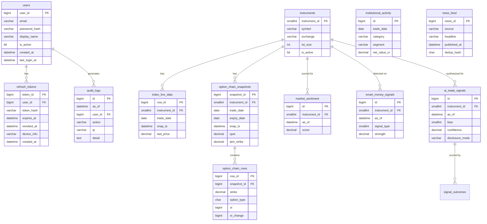

# Database Schema

Database: **StrikfinDB** (PostgreSQL 16+)
Connection: host/port with user + password (`postgresql+asyncpg://…`)
ORM: SQLAlchemy 2.0 async (asyncpg driver)

All market data tables are **append-only** — rows are inserted, never updated in place. The mutable tables are the auth/config set (`users`, `refresh_tokens`, `user_preferences`, `broker_connections`) and the multi-tenant plane (`organizations`, `memberships`, `roles`, `permissions`, `role_permissions`, `api_keys`, `plans`, `subscriptions`).

---

## Tables

### `users`

Application accounts. Each user gets a personal `organization` on register (multi-tenant plane below).

| Column | Type | Nullable | Default | Notes |
|---|---|---|---|---|
| `user_id` | BIGINT | No | autoincrement PK | |
| `email` | VARCHAR(255) | No | — | Unique, indexed |
| `password_hash` | VARCHAR(255) | No | — | bcrypt hash |
| `display_name` | VARCHAR(100) | Yes | NULL | |
| `phone` | VARCHAR(20) | Yes | NULL | Settings-page profile field |
| `state` | VARCHAR(64) | Yes | NULL | Settings-page profile field |
| `auth_provider` | VARCHAR(20) | No | `'email'` | `email` / future OAuth providers |
| `is_active` | BOOLEAN | No | `True` | Soft-disable without deleting |
| `created_at` | DATETIME | No | `utcnow()` | |
| `last_login_at` | DATETIME | Yes | NULL | Updated on each login |

**Relationships:** one-to-many → `refresh_tokens`, `audit_logs`; one-to-one → `user_preferences`

---

### `user_preferences`

Per-user UI settings (1:1 with `users`), persisted from the Settings page so they survive reloads/devices.

| Column | Type | Nullable | Default | Notes |
|---|---|---|---|---|
| `user_id` | BIGINT | No | PK, FK → `users` (CASCADE) | |
| `theme` | VARCHAR(20) | Yes | NULL | `classic` / `warm` / `dark` / `terminal` |
| `show_chart_tooltip` | BOOLEAN | No | `true` | Toggles the ECharts tooltip |
| `call_put_scheme` | VARCHAR(16) | No | `'classic'` | `classic` / `inverted` call-put colours |
| `created_at` | DATETIME | No | `utcnow()` | |
| `updated_at` | DATETIME | No | `utcnow()` (on update) | |

**API:** `GET/PUT /me/preferences`. Seeded into the frontend `usePreferences` store at login.

---

### `refresh_tokens`

Stores hashed refresh tokens for token rotation. Revoked tokens are soft-deleted via `revoked_at`.

| Column | Type | Nullable | Default | Notes |
|---|---|---|---|---|
| `token_id` | BIGINT | No | autoincrement PK | |
| `user_id` | BIGINT | No | — | FK → `users.user_id` |
| `token_hash` | VARCHAR(255) | No | — | SHA-256 hash of raw token. Unique. |
| `expires_at` | DATETIME | No | — | |
| `revoked_at` | DATETIME | Yes | NULL | Set on logout or rotation |
| `device_info` | VARCHAR(300) | Yes | NULL | User-Agent header truncated to 300 chars |
| `created_at` | DATETIME | No | `utcnow()` | |

**Indexes:** `ix_refresh_tokens_user` on (`user_id`)

---

### `instruments`

Instrument **master** — the single source of truth for what an instrument *is* (symbols, lot size, strike step, expiry rule, per-vendor symbol map). Replaces the hardcoded per-id dicts that used to live in providers/services. Read via `app.instruments.InstrumentRef`, never by keying a module dict on a magic id. Exposed through `/instruments`, `/instruments/search`, `/instruments/{id}`.

| Column | Type | Nullable | Default | Notes |
|---|---|---|---|---|
| `instrument_id` | SMALLINT | No | PK (manual) | 1 = NIFTY50, 2 = SENSEX, … |
| `uid` | UUID | No | `gen_random_uuid()` | Opaque external id used by the API/frontend |
| `symbol` | VARCHAR(20) | No | — | Unique root symbol (`NIFTY50`, `SENSEX`) |
| `exchange` | VARCHAR(10) | No | — | `NSE` / `BSE` / `MCX` / `CDS` / … |
| `lot_size` | INT | No | — | Current F&O lot size |
| `is_active` | BOOLEAN | No | `True` | |
| `display_name` | VARCHAR(80) | Yes | NULL | |
| `segment` | VARCHAR(20) | Yes | NULL | `INDEX` / `EQUITY` / `FUT` / `OPT` / … |
| `instrument_type` | VARCHAR(20) | Yes | NULL | `INDEX` / `OPTIDX` / … |
| `underlying` | VARCHAR(40) | Yes | NULL | |
| `tick_size` | DECIMAL(12,4) | Yes | NULL | |
| `strike_step` | DECIMAL(12,2) | Yes | NULL | Replaces mock `_STEP` / `round(spot/50)` |
| `expiry_rule` | VARCHAR(40) | Yes | NULL | Replaces the last-Thursday builder |
| `vendor_symbols` | JSONB | No | `{}` | Per-vendor symbol map (spot/option/futures template) |
| `snapshot_enabled` | BOOLEAN | No | `true` | Whether the scheduler snapshots this instrument |
| `status` | VARCHAR(20) | No | `'ACTIVE'` | `ACTIVE` / `DELISTED` / `SUSPENDED` |

---

### `index_live_data`

Append-only 1-minute snapshots of index prices and VIX.

| Column | Type | Nullable | Default | Notes |
|---|---|---|---|---|
| `row_id` | BIGINT | No | autoincrement PK | |
| `instrument_id` | SMALLINT | No | — | FK → `instruments.instrument_id` |
| `trade_date` | DATE | No | — | Calendar date (IST) |
| `snap_ts` | DATETIME | No | — | Exact snapshot timestamp (UTC) |
| `last_price` | DECIMAL(12,2) | No | — | Last traded price |
| `open_price` | DECIMAL(12,2) | Yes | NULL | |
| `high_price` | DECIMAL(12,2) | Yes | NULL | |
| `low_price` | DECIMAL(12,2) | Yes | NULL | |
| `prev_close` | DECIMAL(12,2) | Yes | NULL | Previous day close |
| `change_pct` | DECIMAL(7,3) | Yes | NULL | % change from prev_close |
| `volume` | BIGINT | Yes | NULL | |
| `india_vix` | DECIMAL(7,3) | Yes | NULL | India VIX at this snapshot |

**Indexes:** `ix_index_live_data_lookup` on (`instrument_id`, `trade_date`, `snap_ts`)

---

### `option_chain_snapshots`

Header record for each option chain pull. Child rows live in `option_chain_rows`.

| Column | Type | Nullable | Default | Notes |
|---|---|---|---|---|
| `snapshot_id` | BIGINT | No | autoincrement PK | |
| `instrument_id` | SMALLINT | No | — | FK → `instruments.instrument_id` |
| `trade_date` | DATE | No | — | |
| `expiry_date` | DATE | No | — | Near-month expiry date |
| `snap_ts` | DATETIME | No | — | Snapshot timestamp (UTC) |
| `spot` | DECIMAL(12,2) | No | — | Underlying spot at this snapshot |
| `future_price` | DECIMAL(12,2) | Yes | NULL | Tradable current-month FUTURES price (`> 0` check). Options Lab price overlays plot this, not spot; falls back to `spot` on read for pre-column rows / failed fetch |
| `atm_strike` | DECIMAL(12,2) | No | — | At-the-money strike |
| `total_call_oi` | BIGINT | Yes | NULL | Sum of all CE OI |
| `total_put_oi` | BIGINT | Yes | NULL | Sum of all PE OI |
| `pcr_oi` | DECIMAL(8,4) | Yes | NULL | Put OI / Call OI |
| `pcr_volume` | DECIMAL(8,4) | Yes | NULL | Put Volume / Call Volume |
| `max_pain_strike` | DECIMAL(12,2) | Yes | NULL | Computed max-pain expiry price |

**Indexes:** `ix_oc_snapshots_lookup` on (`instrument_id`, `trade_date`, `snap_ts`)

---

### `option_chain_rows`

Per-strike option data, child of `option_chain_snapshots`.

| Column | Type | Nullable | Default | Notes |
|---|---|---|---|---|
| `row_id` | BIGINT | No | autoincrement PK | |
| `snapshot_id` | BIGINT | No | — | FK → `option_chain_snapshots.snapshot_id` |
| `trade_date` | DATE | No | — | Denormalized for fast date-only queries |
| `strike` | DECIMAL(12,2) | No | — | Strike price |
| `option_type` | CHAR(2) | No | — | `CE` or `PE` |
| `ltp` | DECIMAL(12,2) | Yes | NULL | Last traded price |
| `oi` | BIGINT | Yes | NULL | Open interest (contracts) |
| `oi_change` | BIGINT | Yes | NULL | Change in OI since last snapshot |
| `volume` | BIGINT | Yes | NULL | |
| `iv` | DECIMAL(7,3) | Yes | NULL | Implied volatility (%) |
| `delta` | DECIMAL(7,4) | Yes | NULL | Greek delta |
| `theta` | DECIMAL(9,4) | Yes | NULL | Greek theta |
| `vega` | DECIMAL(9,4) | Yes | NULL | Greek vega |
| `gamma` | DECIMAL(9,6) | Yes | NULL | Greek gamma |
| `buildup_type` | SMALLINT | Yes | NULL | 1=LongBuildup 2=ShortBuildup 3=ShortCovering 4=LongUnwinding |

**Indexes:** `ix_oc_rows_snap` on (`snapshot_id`, `option_type`, `strike`)

---

### `institutional_activity`

EOD FII/DII cash and futures flow data. Append-only.

| Column | Type | Nullable | Default | Notes |
|---|---|---|---|---|
| `id` | BIGINT | No | autoincrement PK | |
| `trade_date` | DATE | No | — | |
| `category` | VARCHAR(10) | No | — | `FII` or `DII` |
| `segment` | VARCHAR(20) | No | — | `CASH` or `IDX_FUT` |
| `buy_value_cr` | DECIMAL(16,2) | Yes | NULL | Gross buy value (₹ crore) |
| `sell_value_cr` | DECIMAL(16,2) | Yes | NULL | Gross sell value (₹ crore) |
| `net_value_cr` | DECIMAL(16,2) | Yes | NULL | Net (buy − sell) in ₹ crore |
| `long_contracts` | BIGINT | Yes | NULL | FII long contracts (IDX_FUT segment only) |
| `short_contracts` | BIGINT | Yes | NULL | FII short contracts (IDX_FUT segment only) |
| `is_provisional` | BOOLEAN | No | `True` | False once NSDL/CDSL final data confirmed |
| `source_ts` | DATETIME | No | — | When data was sourced |

**Unique constraint:** `uq_inst` on (`trade_date`, `category`, `segment`, `is_provisional`)
**Indexes:** `ix_inst_date_cat` on (`trade_date`, `category`)

---

### `news_feed`

Ingested news headlines deduplicated by SHA-256 hash.

| Column | Type | Nullable | Default | Notes |
|---|---|---|---|---|
| `news_id` | BIGINT | No | autoincrement PK | |
| `source` | VARCHAR(80) | No | — | Publisher name |
| `headline` | VARCHAR(500) | No | — | |
| `url` | VARCHAR(800) | Yes | NULL | Source article URL |
| `published_at` | DATETIME | No | — | Publisher's timestamp |
| `dedup_hash` | CHAR(64) | No | — | SHA-256 of normalized headline. Unique. |
| `category` | VARCHAR(40) | Yes | NULL | `RBI` `MACRO` `GLOBAL` `EARNINGS` `INDEX` |
| `ingested_at` | DATETIME | No | `utcnow()` | |

**Indexes:** `ix_news_pub` on (`published_at`)

---

### `market_sentiment`

Scored sentiment result for each analysis run.

| Column | Type | Nullable | Default | Notes |
|---|---|---|---|---|
| `id` | BIGINT | No | autoincrement PK | |
| `instrument_id` | SMALLINT | Yes | NULL | FK → `instruments.instrument_id` (NULL = market-wide) |
| `as_of` | DATETIME | No | — | Analysis timestamp |
| `model` | VARCHAR(40) | No | — | e.g. `mock-md5` or `finbert-v1` |
| `label` | SMALLINT | No | — | `-1` Bearish · `0` Neutral · `1` Bullish |
| `score` | DECIMAL(6,4) | No | — | Aggregate score in [−1, +1] |
| `confidence` | DECIMAL(6,4) | No | — | |
| `rationale` | VARCHAR(1000) | Yes | NULL | Plain-English summary |

**Indexes:** `ix_sentiment_asof` on (`instrument_id`, `as_of`)

---

### `market_regime` — **removed**

> The standalone regime classifier (engine, service, router, and this table) has
> been removed. Bias classification now lives in the `synthesizer` engine and is
> persisted to `ai_trade_signals` (below). The ORM no longer defines this table;
> a legacy database may still contain it as an orphaned, unused table.

---

### `smart_money_signals`

Append-only per-signal records for smart-money detection.

| Column | Type | Nullable | Default | Notes |
|---|---|---|---|---|
| `id` | BIGINT | No | autoincrement PK | |
| `instrument_id` | SMALLINT | No | — | FK → `instruments.instrument_id` |
| `as_of` | DATETIME | No | — | |
| `signal_type` | SMALLINT | No | — | 1=LongBuildup 2=ShortBuildup 3=LongUnwind 4=ShortCover 5=UnusualOI 6=UnusualVol |
| `strike` | DECIMAL(12,2) | Yes | NULL | Strike where signal fired |
| `option_type` | CHAR(2) | Yes | NULL | `CE` or `PE` |
| `strength` | DECIMAL(6,4) | No | — | `abs(oi_change) / oi`, clamped 0–1 |
| `confidence` | DECIMAL(6,4) | No | — | `0.40 + strength × 0.55`, capped 0.92 |
| `evidence` | TEXT | Yes | NULL | JSON detail |

**Indexes:** `ix_sm_asof` on (`instrument_id`, `as_of`)

---

### `ai_trade_signals`

Append-only synthesized AI bias signal per run.

| Column | Type | Nullable | Default | Notes |
|---|---|---|---|---|
| `id` | BIGINT | No | autoincrement PK | |
| `instrument_id` | SMALLINT | No | — | FK → `instruments.instrument_id` |
| `as_of` | DATETIME | No | — | |
| `bias` | SMALLINT | No | — | `1` Bullish · `0` Neutral · `-1` Bearish |
| `entry_ref` | DECIMAL(12,2) | Yes | NULL | Illustrative entry (NOT advice) |
| `stop_ref` | DECIMAL(12,2) | Yes | NULL | Illustrative stop (NOT advice) |
| `target_ref` | DECIMAL(12,2) | Yes | NULL | Illustrative target (NOT advice) |
| `risk_reward` | DECIMAL(6,2) | Yes | NULL | `reward / risk` ratio |
| `confidence` | DECIMAL(6,4) | No | — | 0.30–0.95 |
| `reasoning` | TEXT | Yes | NULL | Plain-English explanation |
| `disclosure_mode` | VARCHAR(20) | No | `intelligence` | Always `intelligence` |
| `model_version` | VARCHAR(30) | No | — | e.g. `synthesizer-v1.1` |

**Indexes:** `ix_ai_signals_asof` on (`instrument_id`, `as_of`)

---

### `signal_outcomes`

One row per scored AI signal (1:1 with `ai_trade_signals` via a unique `signal_id`). Written and updated by the background scorer loop / `outcome` engine; read by `/signals/{id}/accuracy`.

| Column | Type | Nullable | Default | Notes |
|---|---|---|---|---|
| `id` | BIGINT | No | autoincrement PK | |
| `signal_id` | BIGINT | No | — | **Unique** FK → `ai_trade_signals.id` |
| `instrument_id` | SMALLINT | No | — | FK → `instruments.instrument_id` |
| `bias` | SMALLINT | No | — | `1` / `0` / `-1` (copied from the signal) |
| `status` | VARCHAR(12) | No | — | `OPEN` · `WIN` · `LOSS` · `EXPIRED` · `NEUTRAL` |
| `realized_r` | DECIMAL(8,3) | Yes | NULL | Realised R-multiple once settled |
| `exit_price` | DECIMAL(12,2) | Yes | NULL | Price at hit/expiry |
| `bars_held` | INTEGER | Yes | NULL | Snapshots from issue to settle |
| `signal_as_of` | DATETIME | No | — | Timestamp of the source signal |
| `evaluated_at` | DATETIME | No | now | Last re-score time |

**Indexes:** `ix_outcome_lookup` on (`instrument_id`, `status`), `ix_outcome_signal` on (`signal_id`)

---

### `audit_logs`

Append-only security and action audit trail.

| Column | Type | Nullable | Default | Notes |
|---|---|---|---|---|
| `id` | BIGINT | No | autoincrement PK | |
| `as_of` | DATETIME | No | `utcnow()` | |
| `user_id` | BIGINT | Yes | NULL | FK → `users.user_id` (NULL for pre-auth events) |
| `action` | VARCHAR(80) | No | — | e.g. `REGISTER`, `LOGIN`, `LOGOUT` |
| `ip` | VARCHAR(45) | Yes | NULL | Client IP (supports IPv6) |
| `detail` | TEXT | Yes | NULL | JSON extra context |

**Indexes:** `ix_audit_user` on (`user_id`, `as_of`), `ix_audit_action` on (`action`, `as_of`)

---

### `broker_connections`

Per-user link to a broker/data vendor (Fyers today; Zerodha/Angel later). Tokens are stored **encrypted (Fernet)** — never plaintext. Retires the single global in-memory + `.env` Fyers token. `user_id` is nullable for now (the Fyers OAuth callback is unauthenticated → that row is the implicit global connection).

| Column | Type | Nullable | Default | Notes |
|---|---|---|---|---|
| `id` | UUID | No | `gen_random_uuid()` PK | |
| `user_id` | BIGINT | Yes | NULL | FK → `users` (CASCADE) |
| `broker` | VARCHAR(20) | No | — | `fyers` / `zerodha` / … |
| `access_token_enc` | TEXT | Yes | NULL | Fernet-encrypted access token |
| `refresh_token_enc` | TEXT | Yes | NULL | Fernet-encrypted refresh token |
| `meta` | JSONB | No | `{}` | |
| `status` | VARCHAR(20) | No | `'ACTIVE'` | `ACTIVE` / `EXPIRED` / `REVOKED` |
| `generated_at` / `expires_at` | DATETIME | Yes | NULL | |
| `created_at` / `updated_at` | DATETIME | No | `utcnow()` | |

**Indexes:** `ix_broker_conn_user_broker` on (`user_id`, `broker`)

---

## Multi-tenant plane (M5)

Tenant-scoped tables use **UUID PKs** and `created/updated/deleted` audit columns. Postgres **RLS** policies (defined in the migration) key on `current_setting('app.tenant_id')`; app-layer scoping in the services is the primary enforcement while the app runs as a superuser role. Router: `tenancy.py` (`/me/tenancy`, `/orgs`, `/orgs/{id}/members`, `/api-keys`). See [SAAS_MIGRATION_NOTES.md](SAAS_MIGRATION_NOTES.md).

| Table | Purpose | Key columns |
|---|---|---|
| `organizations` | A tenant; every user gets a personal org on register | `id` UUID PK, `name`, `slug` (unique), `owner_user_id` FK, `plan_key` (`free`…), `is_personal`, soft-delete `deleted_at` |
| `roles` | Named permission bundle | `id` UUID PK, `key` (`owner`/`admin`/`analyst`/`viewer`), `name`, `is_system` |
| `permissions` | A grantable capability | `id` UUID PK, `key` (e.g. `instrument.read`), `description` |
| `role_permissions` | Role ↔ Permission M2M | (`role_id`, `permission_id`) composite PK |
| `memberships` | A user's role within an org | `id` UUID PK, `org_id` FK, `user_id` FK, `role_id` FK, `status`; unique (`org_id`,`user_id`) |
| `api_keys` | Per-org key for the public REST/SDK plane (hash only) | `id` UUID PK, `org_id` FK, `name`, `key_prefix`, `key_hash` (unique), `scopes` JSONB, `revoked_at` |
| `plans` | Subscription tier + limits (seeded reference data) | `id` UUID PK, `key` (`free`/`pro`/`desk`/`enterprise`), `price_inr`, `limits` JSONB |
| `subscriptions` | An org's current plan subscription | `id` UUID PK, `org_id` FK, `plan_key`, `status`, `provider` (`manual`/`razorpay`), `provider_ref`, `current_period_end` |

---

## Entity Relationship Diagram

---

## Append-only vs Mutable Tables

| Table | Mutation Policy |
|---|---|
| `users` | Mutable — `is_active`, `last_login_at` are updated |
| `refresh_tokens` | Mutable — `revoked_at` is set on logout/rotation |
| `instruments` | Mutable — `is_active` can change |
| `index_live_data` | **Append-only** |
| `option_chain_snapshots` | **Append-only** |
| `option_chain_rows` | **Append-only** |
| `institutional_activity` | Append-only (unique constraint prevents exact duplicates) |
| `news_feed` | **Append-only** (dedup_hash prevents duplicate headlines) |
| `market_sentiment` | **Append-only** |
| `smart_money_signals` | **Append-only** |
| `ai_trade_signals` | **Append-only** |
| `signal_outcomes` | Mutable — updated as a signal is re-scored, then settled (`status` OPEN→WIN/LOSS/EXPIRED/NEUTRAL) |
| `audit_logs` | **Append-only** |

---

## Views and Stored Procedures

<!-- TODO: confirm — no SQL views or stored procedures are defined in the current codebase or Alembic migrations. The alembic/versions/ directory is empty. Add entries here once views/procs are created. -->

No database views or stored procedures exist at this time. All aggregation and computation happens in the Python engine and service layers.
